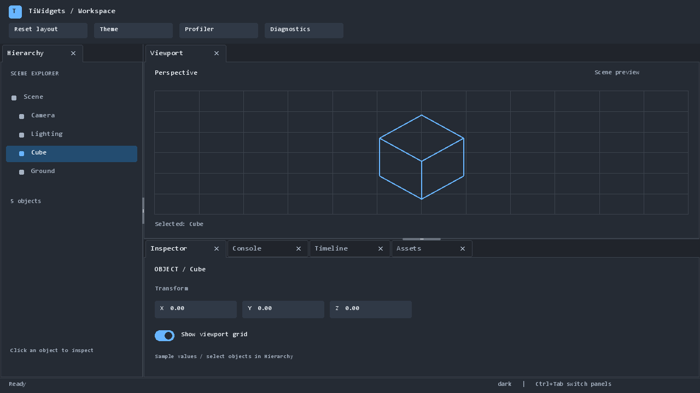

# TiWidgets

Native C++17 docking framework with a DirectX 12 workspace demo.

Preview the UI and check developer milestones:

```powershell
powershell -ExecutionPolicy Bypass -File .\scripts\check_ui_milestones.ps1 -Config Debug -CapturePreviews
```

This builds the project, runs docking and workspace tests, captures dark/light/slate
and compact previews, and compares normal rendering with a GPU batching stress
capture. Each milestone prints progress and writes logs, JUnit results and
`artifacts/milestones/latest-Debug.json`. Omit `-CapturePreviews` for unattended
checks; the report explicitly marks visual capture as skipped.

Open the interactive preview after building:

```powershell
powershell -ExecutionPolicy Bypass -File .\scripts\preview_ui.ps1 -LeaveOpen
```

[Changes, verification and debug checkpoints](docs/UI_MILESTONES.md).



## Automation Quick Start

Canonical build directory: `build_dx12`

Debug guide:
`docs/DEBUG_FLOW_BREAKPOINTS.md`

VS Code multi-app debug setup:
- Launch config file: `.vscode/launch.json`
- App launcher scripts: `scripts/launch_pws.ps1` (alias), `scripts/launch_app.ps1`

### One-command build + checks
```powershell
powershell -ExecutionPolicy Bypass -File .\scripts\auto_build_and_check.ps1 -Config Debug -Reconfigure
```

### Full sweep (edge cases, resources, crash reporter)
```powershell
powershell -ExecutionPolicy Bypass -File .\scripts\auto_build_and_check.ps1 -Config Debug -RunEdgeCases -CheckResources -CheckCrashReporter
```

### Full sweep + JSON analysis report
```powershell
powershell -ExecutionPolicy Bypass -File .\scripts\auto_build_and_check.ps1 -Config Debug -RunEdgeCases -CheckResources -RunAnalysis
```

Optional IntelliSense context validation in the same run:
`-CheckIntelliSense`

### Nightly mode (full checks + archived artifacts)
```powershell
powershell -ExecutionPolicy Bypass -File .\scripts\auto_build_and_check.ps1 -Config Debug -Nightly
```

Optional nightly controls:
`-NightlyRoot artifacts -NightlyKeep 14`

### Event automation only
```powershell
powershell -ExecutionPolicy Bypass -File .\scripts\run_event_automation.ps1 -Config Debug -Scenario baseline
```

### Analyze latest logs
```powershell
powershell -ExecutionPolicy Bypass -File .\scripts\analyze_logs.ps1
```

### IntelliSense sanity check (CMake + key targets)
```powershell
powershell -ExecutionPolicy Bypass -File .\scripts\check_intellisense.ps1 -Config Debug -Reconfigure
```

### List available built apps (for debug target selection)
```powershell
powershell -ExecutionPolicy Bypass -File .\scripts\launch_pws.ps1 -BuildDir build_dx12 -Config Debug -ListOnly
```

### Launch app interactively (then use "Attach To Running Process")
```powershell
powershell -ExecutionPolicy Bypass -File .\scripts\launch_pws.ps1 -BuildDir build_dx12 -Config Debug
```

### Run edge-case scenarios only
```powershell
powershell -ExecutionPolicy Bypass -File .\scripts\test_edge_cases.ps1 -Config Debug
```

### Resource usage check
```powershell
powershell -ExecutionPolicy Bypass -File .\scripts\check_resources.ps1 -Config Debug
```

### Crash reporter smoke test
```powershell
powershell -ExecutionPolicy Bypass -File .\scripts\check_crash_reporter.ps1 -Config Debug
```
